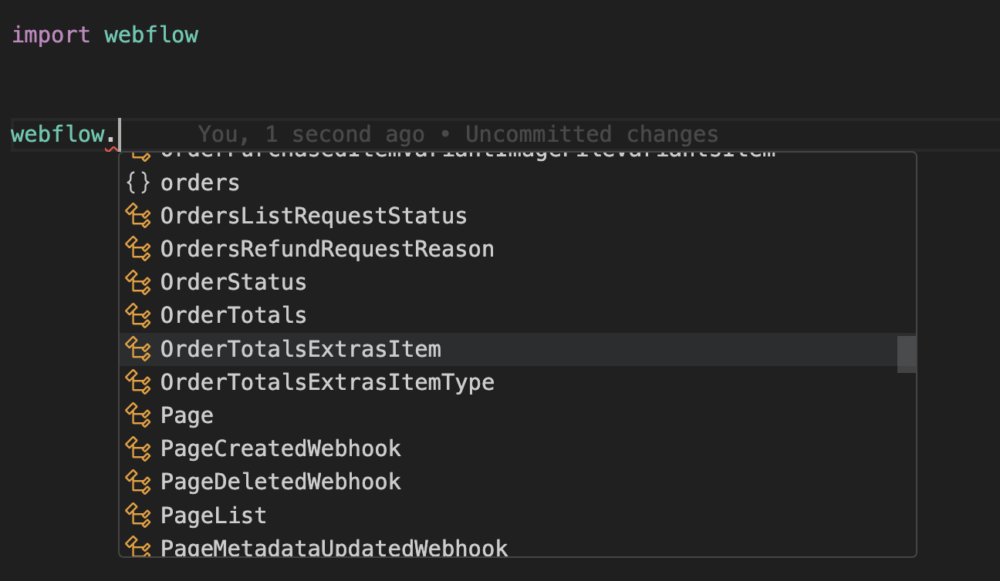

# Webflow Python Library

[](https://github.com/fern-api/fern)
[](https://pypi.python.org/pypi/webflow)

The Webflow Python Library provides convenient access to the [Webflow Data API](https://developers.webflow.com/reference/rest-introduction) from 
applications written in Python. 

The library includes type definitions for all 
request and response fields, and offers both synchronous and asynchronous clients powered by httpx.

## Documentation

Explore the API reference documentation [here](https://developers.webflow.com/reference/rest-introduction).

## Installation

Add this dependency to your project's build file:

```bash
pip install webflow
# or
poetry add webflow
```

## Usage
Simply import `Webflow` and start making calls to our API. 

```python
from webflow.client import Webflow

client = Webflow(
  access_token="YOUR_ACCESS_TOKEN"
)
site = client.sites.get("site-id")
```

## Async Client
The SDK also exports an async client so that you can make non-blocking
calls to our API. 

```python
from webflow.client import AsyncWebflow

client = AsyncWebflow(
  access_token="YOUR_ACCESS_TOKEN"
)

async def main() -> None:
    site = await client.sites.get("site-id")
    print("Received site", site)

asyncio.run(main())
```

## OAuth

To implement OAuth, you'll need to [register a Webflow App in your Workspace](https://developers.webflow.com/reference/authorization)

### Step 1: Authorize URL 

The first step in OAuth is to generate an Authorization URL. Use this URL 
to fetch your Authorization Code. See the [docs](https://docs.developers.webflow.com/v1.0.0/docs/oauth#user-authorization)
for more details. 

```python
from webflow.oauth import authorize_url
from webflow import OauthScope

url = authorize_url(
  client_id="YOUR_CLIENT_ID",
  scope=OauthScope.USERS_READ, # or [OauthScope.USERS_READ, OauthScope.USERS_WRITE]
  state="1234567890", # optional
  redirect_uri="https://my.server.com/oauth/callback", # optional
)

print(url)
```

### Step 2: Retrieve your acccess token
Use the `get_access_token` function and pass in your `client_id`, 
`client_secret`, and `authorization_code`. 

```python
from webflow.oauth import get_access_token

access_token = get_access_token(
  client_id="YOUR_CLIENT_ID", 
  client_secret="YOUR_CLIENT_SECRET", 
  code="YOUR_AUTHORIZATION_CODE"
  )
```

### Step 3: Instantiate the client
Instantiate the client using your `access_token`. 

```python
from webflow.client import Webflow

client = Webflow(
  access_token=access_token
)
```

## Webflow Module
All of the models are nested within the Webflow module. Let IntelliSense 
guide you! 



## Exception Handling
All errors thrown by the SDK will be subclasses of [`ApiError`](./src/webflow/core/api_error.py).

```python
import webflow

try:
  client.sites.get(...)
except webflow.core.ApiError as e: # Handle all errors
  print(e.status_code)
  print(e.body)
except webflow.BadRequestError as e: # Handle specific error
  print(e.status_code)
  print(e.body)
```

## Advanced

### Timeouts
By default, requests time out after 60 seconds. You can configure this with a 
timeout option, which accepts a float.

```python
from webflow.client import Webflow

client = Webflow(
    # 20 seconds
    timeout=20.0,
)
```

### Custom HTTP client
You can override the httpx client to customize it for your use-case. Some common use-cases 
include support for proxies and transports.

```python
import httpx

from webflow.client import Webflow

client = Webflow(
    http_client=httpx.Client(
        proxies="http://my.test.proxy.example.com",
        transport=httpx.HTTPTransport(local_address="0.0.0.0"),
    ),
)
```

## Beta Status

This SDK is in **Preview**, and there may be breaking changes between versions without a major 
version update. 

To ensure a reproducible environment (and minimize risk of breaking changes), we recommend pinning a specific package version.

## Contributing

While we value open-source contributions to this SDK, this library is generated programmatically. 
Additions made directly to this library would have to be moved over to our generation code, 
otherwise they would be overwritten upon the next generated release. Feel free to open a PR as
 a proof of concept, but know that we will not be able to merge it as-is. We suggest opening 
an issue first to discuss with us!

On the other hand, contributions to the README are always very welcome!
